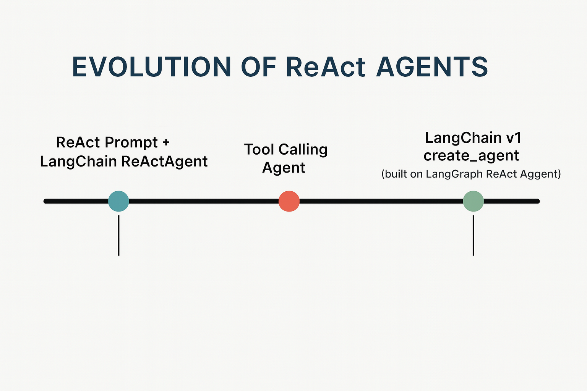

Real apps rarely want **free-form text**.  
They usually want **structured data**: JSON you can save, validate, and show in a UI.

There are two main ways to do this in LangChain:

1. **Old way** – manual Pydantic parsing  
2. **New way (recommended)** – `with_structured_output`

This post explains both in simple terms and why the new way is better.

### A. Old way recap (manual Pydantic parsing)

- We:
	- Inject _format instructions_ (JSON schema) into the prompt.
    - Ask the LLM: “Please answer in this JSON shape.”
    - Hope the model follows it.
    - Take `result["output"]` (JSON string) and run:
        - `output_parser.parse(json_string)` → `AgentResponse`.


Problems:
- We repeat the **schema text** in _every_ ReAct step (wasting tokens).
- We rely on the model to obey the format just from text (less reliable, esp. older models).
- We manually wire the parser and parsing step.

Memory line:

> Old way = **“prompt + hope + parse”**.

### B. New way: `with_structured_output` (preferred)

**Core idea:**
The new method is much simpler:

> Tell the model **once** what schema you want,  
> and let LangChain + function calling handle the rest.


Example (simplified):
```python
from langchain_openai import ChatOpenAI
from schemas import AgentResponse  # Pydantic model

llm = ChatOpenAI(model="gpt-4o")

structured_llm = llm.with_structured_output(AgentResponse)

```

- `structured_llm` is a **wrapped version** of the model.
- When you call it, it will **return an `AgentResponse` object**, not a plain string.
- Internally it uses:
    - function calling,
    - JSON schema,
    - and `PydanticOutputParser` – but you don’t need to touch any of that.


### 2.2. Calling the structured LLM

Simple example:
```python
result: AgentResponse = structured_llm.invoke(
    "What is the AQI in Gurgaon sector 46 today?"
)

print(result.response)
for s in result.sources:
    print(s.url)
```

You directly get:

- `result.response` – the main answer text
- `result.sources` – list of `Source` objects with `.url`

No manual parsing. No format instructions in your prompt.


## 3. Quick comparison – old vs new

### Old: manual Pydantic parsing

- You:
    - Inject schema text into the prompt.
    - Hope the model respects it.
    - Manually call `output_parser.parse(...)`.

- Downsides:
    - More boilerplate.
    - Schema text repeated many times → more tokens.
    - Less robust on weaker models.

### New: `with_structured_output`
- You:
    - Define your Pydantic model (`AgentResponse`).
    - Call `llm.with_structured_output(AgentResponse)`.
    - Use the returned model instance.
        
- Benefits:
    - Very little code.
    - LangChain sends the schema using **function calling**.
    - LangChain parses the JSON into Pydantic for you.
    - More reliable and cleaner.
        

Memory line:

> New way = **“declare schema once → always get structured data back.”**


---

## 4. When should you use it?

As long as your model supports **function calling** (all modern major models do),  
the recommended approach is:


---

## Evolution of ReAct Agents


